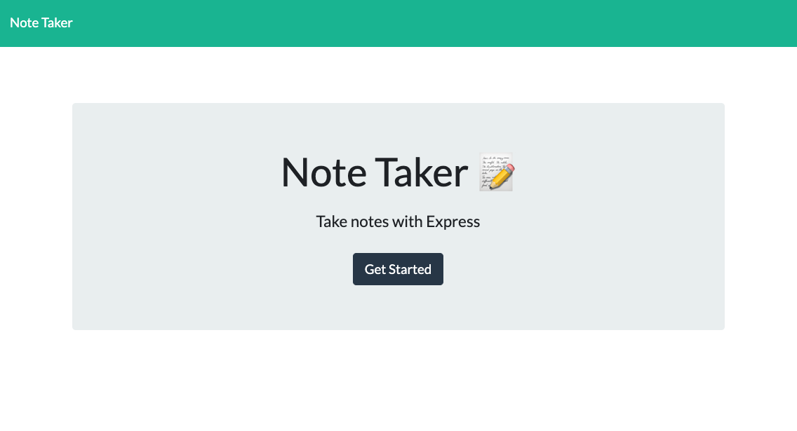

# Note Taker
A web application that can be used to write and save notes. You can enter a note and save. The list of notes will be on the left side. To delete a note, click the delete button, and the page is refreshed, with the delete note no longer showing.

***
### Table of Contents  
1. [Installation](https://github.com/MLLynch2K/note-taker#installation)
2. [Heroku Deployment](https://github.com/MLLynch2K/note-taker#heroku-deployment)
3. [Screenshot](https://github.com/MLLynch2K/note-taker#screenshot)
4. [Features](https://github.com/MLLynch2K/note-taker#features)
5. [License](https://github.com/MLLynch2K/note-taker#licenses)
6. [Contributors](https://github.com/MLLynch2K/note-taker#contributors)
7. [Questions](https://github.com/MLLynch2K/note-taker#questions)  

***
### Installation 
Clone Repository, Run NPM Install, Run NPM i Uniquid

### Heroku Deployment
[Heroku Deployment Link](https://radiant-ravine-39961.herokuapp.com/)

***
### Screenshot  

***
### Features  
HTML/CSS  
JavaScript    
NPM    
Node.js   
Express.js  
Uniquid  
fs  
Heroku  

***
### Licenses   
MIT  
ISC

***
### Contributors  
Back-end: Michele Lee Lynch

***
### Questions  
Contact information for questions:  
Github: MLLynch2K  
Email: michele.lynch8@yahoo.com